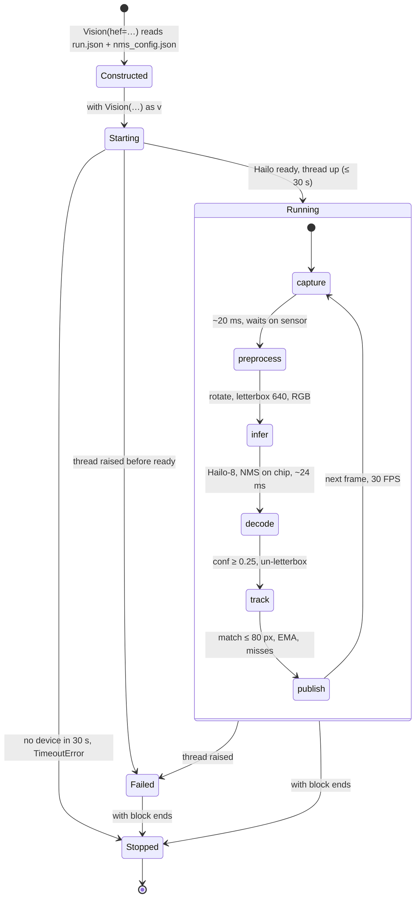
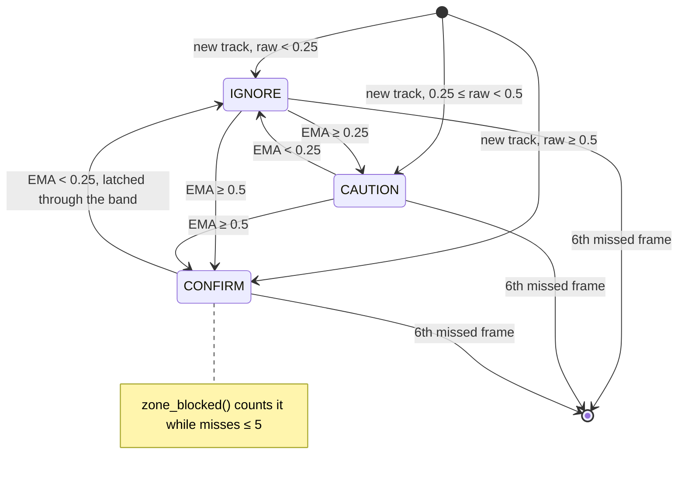

# Robot integration — the CV seam

For whoever owns the Pi control loop and the ESP32. You do not need to understand
the detector, the training pipeline or the export toolchain. You need one class,
one boolean, and one opt-in record for your log.

The vision package is a library you import in your own process. There is no
daemon, no socket, no ROS2 node — PRD §5 puts a Python asyncio loop on the Pi with
no middleware, and this is built for exactly that.

One release tag carries both the wheel and the model bundle. The code hardcodes
which model it expects (`fodcv.paths.DEPLOY_HEF`), so a model change is a code
change, and the two are never pinned apart.

---

## 1. Install

Into the Pi's **system** interpreter, not a venv, from the wheel on the release:

```bash
sudo python3.11 -m pip install --break-system-packages \
  https://github.com/Bthcorn/fod-robot-cv-poc/releases/download/v0.3.0/fod_vision-0.3.0-py3-none-any.whl
```

System 3.11 because apt's `python3-picamera2` is built against it, and a 3.12 venv
is a different C ABI — `import libcamera` fails there no matter what pip does. The
repo's `.python-version` says 3.12; that is for Mac-side training work and does not
apply to you.

The board needs these from apt (Raspberry Pi OS Bookworm) before that line:

| package | for |
|---|---|
| `python3-picamera2` | the camera; pulls in libcamera, numpy and cv2 |
| `hailo-all` | HailoRT, the `hailo_platform` bindings, the PCIe driver |

The wheel declares `numpy` and `opencv-python` and nothing else — no torch, no
ultralytics. Check once that pip did not compile OpenCV: `pip show opencv-python`
should name a wheel and the install should take seconds. If it built from source,
reinstall with `--no-deps` and let apt's cv2 serve.

Record `hailortcli --version` next to the release you install. The `.hef` was
compiled with Dataflow Compiler 3.34.0 and HailoRT must be the matching line; a
mismatch fails at `Vision.__enter__`, not at import.

Nine `fodcv-*` commands land on `PATH`. Two run here: `fodcv-hailo-camera` and
`fodcv-robot-stub`. The other seven are the Mac-side pipeline; on this board they
exit with a one-line install hint rather than a traceback.

**Pin the tag.** A moving `main` under a running robot is not a thing you want to
debug in week 11.

## 2. Get the model

The `.hef` is not in git. Fetch the bundle and the checksums from the same tag —
plain URLs, no `gh` and no GitHub login on the Pi:

```bash
R=https://github.com/Bthcorn/fod-robot-cv-poc/releases/download/v0.3.0
curl -LO $R/arg-bolts-4-n-640.tar.gz -LO $R/SHA256SUMS
sha256sum -c SHA256SUMS --ignore-missing
tar xzf arg-bolts-4-n-640.tar.gz
```

Four files, 7.55 MB, and the layout is load-bearing:

```
artifacts/arg-bolts-4-n-640/
├── run.json                            class names + which dataset trained them
└── bench_int8_hailo_model_conf00001/
    ├── best.hef                        the model
    ├── nms_config.json                 input size, class count, compiled threshold
    └── metadata.yaml                   export provenance; never read at runtime
```

`Vision` reads the class names from the `run.json` **two levels above the `.hef`**
and the input size from the `nms_config.json` **beside it**, and refuses to start if
either is missing or they disagree on the class count. A `.hef` moved one directory
deeper or shallower will not load. The default path, `fodcv.paths.DEPLOY_HEF`, is
relative to the working directory — run the robot from the directory you untarred
into, or pass an absolute `hef=`; the neighbour rule still applies.

**Two alternates ship on the same tag**, for when the default does not suit
(RESULT.md, "Alternates"). Same four classes, same layout; the 480 one unpacks
beside the default inside the same run directory. `DEPLOY_HEF` only knows the
default — pass `Vision(hef=…)` or `--hef` for the others.

| bundle | input | mAP50 | median | pick it when |
|---|---:|---:|---:|---|
| `arg-bolts-4-n-640.tar.gz` | 640 | 0.7715 | 24.4 ms | default |
| `arg-bolts-4-n-640-at480.tar.gz` | 480 | 0.7159 | 16.6 ms | the control loop needs the other 8 ms |
| `arg-bolts-4-s-640-a16.tar.gz` | 640 | 0.6549 | 50.2 ms | misses the 33 ms frame; only if ~20 FPS is acceptable |

`hailortcli parse-hef best.hef` confirms the architecture, class count and score
threshold on the board. That threshold is 0.0001 and it is a compiled **floor**, not
a filter: filter host-side with `conf=` (default 0.25).

## 3. Prove it works, before writing any robot code

```bash
fodcv-hailo-camera --preview        # boxes on screen, focus distance, geometry readout
fodcv-robot-stub --seconds 30       # the loop below, with prints instead of motors
```

Run these first on a new board. They answer "is the camera framed and focused, and
does the chip see anything" while there is still no control loop to blame.
`--preview` needs `DISPLAY=:0`. The stub prints the opt-in record (§5.2) at every
speed change, so you have seen the shape of what you will log before you write the
logger.

## 4. The loop

```python
import asyncio, time
from fodcv.runtime.vision import Vision

CAM_TO_DRUM_M = 0.22        # tape measure on the built chassis (PRD O-3)
HEF = "artifacts/arg-bolts-4-n-640/bench_int8_hailo_model_conf00001/best.hef"

with Vision(hef=HEF, lookahead=(0.5, 1.0)) as vision:
    hold_until = 0.0
    while sweeping:
        if vision.age > 0.5:
            esp32.write("STOP\n")          # stale vision is NOT a clear floor
            continue

        now = time.monotonic()
        if vision.zone_blocked():
            hold_until = now + CAM_TO_DRUM_M / V_SLOW
        esp32.write(f"SPEED {V_SLOW if now < hold_until else V_FAST}\n")

        await asyncio.sleep(1 / 20)
```

That is PRD FR-4 in full. `zone_blocked()` and `latest()` only take a brief lock,
so both are safe to call from inside the asyncio loop; capture and inference run on
their own daemon thread and never block you.

**The hold-off timer is yours, not the vision package's.** Its length is the
camera-to-drum distance over the current speed, and this package does not know your
speed. Re-arm it every frame the zone is blocked, so it measures from when the
object *left* the zone rather than when it entered.

`lookahead` is a `(lo, hi)` fraction of frame height. **The default is a
placeholder, not a measurement** — the real strip falls out of PRD O-3 (camera
height and tilt, undecided) and M-3 (FOV width `W`, lookahead distance `d`,
unmeasured). RESULT.md §8 narrows the tilt to 10–25° at 15–30 cm and no further.

## 5. The contract

Two tiers. **Default** is what the loop branches on: three reads and seven fields,
cheap, and the only things this package promises to keep stable. **Opt-in** is what
you call when you want more — for the log, the telemetry heatmap, the M-12 retune —
and each one says what it costs. Nothing is computed differently when you do not
call it.

### 5.1 Default — branch on these

| read | type | what it means | raises? |
|---|---|---|---|
| `vision.zone_blocked()` | `bool` | a track in state `CONFIRM` whose centroid `y` lies in `[lo·H, hi·H]`, `H` = rotated frame height, any `x`. **Includes tracks coasting** on up to `MAX_MISSES = 5` missed frames (167 ms at 30 FPS), so it can be `True` while `latest()` is empty. Intended: erring slow costs a frame, erring fast costs the pickup | re-raises the capture-thread error |
| `vision.age` | `float` s | `time.monotonic()` seconds since the last completed frame; `inf` before the first. **Never raises** — it only grows. To learn *why*, call `zone_blocked()` or read `detail()["error"]` | no |
| `vision.latest()` | `list[Target]` | a fresh list of the tracks seen **this** frame (`misses == 0`), valid until the next frame; empty is a valid answer | re-raises |

`Target(id, state, action, cls, conf, box, centroid)` is an immutable namedtuple:

| field | type | unit / range | changes when |
|---|---|---|---|
| `id` | `int` | per-process counter; never reused; resets when the process restarts | a new object appears, or the same object returns after more than 5 missed frames |
| `state` | `str` | `IGNORE` / `CAUTION` / `CONFIRM` | the EMA crosses a threshold: `CONFIRM` at ≥ 0.5, latched until it falls below 0.25; `CAUTION` between 0.25 and 0.5 unless already confirmed. **A new track confirms on its first frame if its raw score is ≥ 0.5** — there is no minimum-frames rule |
| `action` | `str` | `PICK` / `REPORT` / `IGNORE` | `cls` changes. Looked up in `policy.ACTIONS`; an unlisted class is `IGNORE`. All four shipped classes map to `PICK` |
| `cls` | `str` | a name from `run.json` | the last matched detection said so — **it can flip on a live track** (a screw read as `bolt` for one frame). Diagnostic; do not branch on it |
| `conf` | `float` 0–1 | EMA of the chip's score, α = 0.4 on the newest frame; the first frame is the raw score | every matched frame. Lags the raw score by design |
| `box` | `(x0, y0, x1, y1)` `int` px | rotated frame, origin top-left, `y` down, clipped to the frame | every matched frame; the last detection's box, unsmoothed; never `None` from a running `Vision` |
| `centroid` | `(x, y)` `float` px | box centre, same frame | every matched frame; unsmoothed; the tracker's match key (80 px radius) |

`cls` is diagnostic on purpose. PRD FR-3 mandates one trained class and the arena
dataset ships that way, at which point `bolt`/`nut`/`screw`/`washer` stop existing.
Code branching on `state` and `action` survives the switch untouched. `state` and
`action` are two fields for a reason: a CAUTION screw and a CAUTION shard both mean
*slow down*, and only the class says which one the magnet can lift.

### 5.2 Opt-in — call it when you want it

| read | returns | cost, caveat |
|---|---|---|
| `vision.detail()` | one `dict`, JSON-serialisable, every field from the same frame: `frame_id`; `age`; `blocked`; `fps`; `stage_ms` `{capture, preprocess, infer, postprocess, total}` of the last frame; `top_scores` `{class: highest raw score}` before any filter; `camera` `{zoom, rotate, conf, frame_size, imgsz, focus_m}` (`focus_m` is the last `focus_state()` reading, not a fresh one); `tracks` — **every live track, coasting ones included** — each `{id, state, action, cls, conf, raw, hits, misses, box, centroid, in_zone}`; `error` — `repr` of the thread's exception, or `null` | one lock. **Never raises.** `age` and `focus_m` can be `Infinity` |
| `vision.snapshot()` | `(frame, list[Target])` — the rotated frame as a BGR `uint8` `H×W×3` array | the frame is **not copied**: draw on a copy. Re-raises |
| `vision.focus_state()` | `(distance_m, FocusFoM)`; `inf` means focused at infinity | **waits one sensor frame** (~33 ms). Never inside the control loop |
| `vision.fps` | `float` | mean of the last 30 `total` timings; `0.0` until frame 6 (five warm-up frames are skipped) |
| `vision.stats` | `{stage: deque[ms]}` | the last 10,000 frames per stage, warm-up excluded |
| `vision.top_scores` | `list[float]` by class id | the same numbers as `detail()["top_scores"]`, positional |
| `vision.classes`, `vision.shown_classes()` | `list[str]` | class-id order from `run.json`; after the `classes=` filter |
| `vision.frame_size`, `vision.frame_id`, `vision.imgsz`, `vision.conf`, `vision.lookahead` | | after rotation; completed frames; from the `.hef`; the host filter; the strip |
| `set_conf(x)`, `set_zoom(f)`, `toggle_class(name)`, `refocus()` | — | safe from your thread. `refocus()` is one AF sweep, then hold |
| `set_rotate(deg)` | — | takes effect on the next frame and **moves every centroid**, so every track re-matches as a new id |

A track's `raw` against its `conf` is the pair the M-12 retune is done on (§7).
`in_zone` is geometry only — inside the strip — and blocks only together with
`state == "CONFIRM"`; `blocked` is the frame-level answer the loop saw.

### 5.3 The camera

Camera Module 3 (`imx708`, 4608×2592, standard 66° lens; the wide variant is 102°).
Every knob is a constructor argument whose default is what RESULT.md measured, so a
robot that passes only `hef=` and `lookahead=` gets the configuration the numbers
describe.

| knob | default | what it does for you |
|---|---|---|
| `hef` | required | see §2 for where its neighbours must be |
| `imgsz` | `None` → read from `nms_config.json` (640) | pass a value only to assert it; a mismatch refuses to start |
| `conf` | 0.25 | host-side filter on the raw chip score, applied before tracking. The compiled floor (0.0001) is below anything you would set |
| `classes` | all of them | a reporting filter; the chip scores every class regardless |
| `width`, `height` | 1280 × 720 | the frame boxes are measured in, before rotation. At this mode the sensor delivers 30 FPS, so `capture` blocks ~20 ms per frame and absorbs whatever inference does not use — **the 33 ms frame is the sensor's cadence, not a compute ceiling** |
| `zoom` | 1.0 | centre crop of the sensor (`ScalerCrop`), clamped 0.15–1.0. 0.5 = the centre half: an object spans twice the frame pixels, the field of view halves. Below `imgsz / sensor_width` the model is fed interpolation |
| `rotate` | 0 | 0 / 90 / 180 / 270 clockwise, applied before inference; `frame_size` swaps at 90 and 270 |
| `sensor_width` | 2304 | raw readout 1536 / 2304 / 4608 (height follows the 16:9 sensor). 2304 is 2×2 binned and sustains 56 FPS; 4608 is sharpest and caps the sensor at 14.3 FPS |
| `focus` | `None` = continuous autofocus, full range | a distance in metres locks the lens there (`LensPosition = 1/m`). libcamera's own default is manual at 1.0 m, which is why this is set explicitly |
| `shutter` | 0 = auto | microseconds, caps exposure time; gain stays automatic. Indoors AE settles near 33,000 µs (1/30 s), which smears anything moving |
| `settle` | 1.0 s | sleep after the camera starts, for AGC/AWB; the first frames are dark without it |
| `lookahead` | (0.5, 1.0) | fraction of rotated frame height; **placeholder** until O-3 and M-3 (§4) |

Frames are BGR in memory (OpenCV order) and converted to RGB for the chip; the
letterbox pads with grey 114, the value the model was calibrated behind. Training
scale is ~11% of the frame: at zoom 1.0 an object is at training scale when
`distance ≈ 7 × its length`, so a 40 mm fastener at about 0.28 m.
`fodcv-hailo-camera` prints the exact numbers for the lens and zoom you run.

### 5.4 Lifecycle

- `with Vision(...) as vision:` — always. `__enter__` opens the camera, starts the
  daemon thread and waits up to 30 s for the Hailo device: `TimeoutError` if it never
  configures, or the thread's own exception if it failed (`ImportError` for
  `hailo_platform` or `picamera2`, a HailoRT error, `AssertionError` for a bundle
  laid out wrong).
- `__exit__` stops the thread (5 s join) and releases the camera. Skipping it
  leaves the device claimed.
- **A `Vision` is single-use.** Re-entering one that has exited raises rather than
  handing back a silently dead object. Construct a new one.
- **One process owns the Hailo.** Never two `Vision` objects; stop
  `fodcv-hailo-camera` before starting the robot.
- Validation is `assert`-based. Do not run the robot under `python -O`.

### 5.5 State machines

Three machines, one inside the next: the object runs a capture thread, each frame
moves tracks through the hysteresis, and the robot turns one boolean from those
tracks into a speed. [`state-machines.html`](state-machines.html) is the same three
drawn with the HUD's own colours — open it in a browser. The mermaid below renders
on GitHub and in Obsidian.

**The Vision object.** Failed is terminal, and a stopped Vision cannot be re-entered.



**One track.** Confidence and presence flicker separately and each has its own
damper: the EMA latch on state, the miss budget on presence. That is why
`zone_blocked()` can be true while `latest()` is empty.



**The robot's speed** (`fodcv-robot-stub`, PRD FR-4). Stale vision is never a
clear floor; the hold-off is re-armed every blocked frame so it measures from when
the object left the zone.

```mermaid
stateDiagram-v2
    [*] --> STOP: no frame yet, age = ∞
    STOP --> SLOW: frames back, zone_blocked()
    STOP --> FAST: frames back, zone clear
    FAST --> SLOW: zone_blocked()
    SLOW --> SLOW: blocked, re-arm hold; or clear but still holding
    SLOW --> FAST: clear and hold expired
    SLOW --> STOP: age > 0.5 s
    FAST --> STOP: age > 0.5 s
```



## 6. Failure modes

- **A dead camera raises, it does not return an empty list.** Any exception on the
  capture thread is stored and re-raised from the next `latest()`,
  `zone_blocked()` or `snapshot()`, and it keeps re-raising: the failure is
  permanent for that object. "No debris, keep patrolling" is the one thing a broken
  camera must never look like.
- **`age` growing means the thread stopped — and `age` itself never raises.** You
  decide the tolerance; the package will not decide it for you. 0.5 s is a starting
  point. If your loop halts on `age` alone, log `detail()["error"]` so the halt
  says why.
- **`zone_blocked()` can be `True` while `latest()` is empty**, for up to five
  frames after the last detection. That is the tracker coasting on its miss
  budget, and it is what stops the speed policy chattering when one frame misses.
  Do not "fix" it by checking `latest()`.
- **A track confirms on its first frame** if the chip scores it ≥ 0.5. A one-frame
  false positive therefore slows the robot for a moment — the intended failure
  direction.

## 7. Retuning the hysteresis (PRD M-12)

FR-4 tags the three thresholds MEASURE and M-12 names the retune on the real mount:

```python
from fodcv.runtime import policy
policy.tune(CONFIRM_THRESH=0.6, EMA_ALPHA=0.3)   # before constructing Vision
```

Tunable: `CONFIRM_THRESH`, `CAUTION_THRESH`, `EMA_ALPHA`, `MAX_MATCH_DIST`,
`MAX_MISSES`. A misspelled name raises rather than silently doing nothing.

`MAX_MISSES` is worth knowing about: it is how many frames a track survives without
a detection, and it is what stops `zone_blocked()` chattering when one frame misses.
Lower it and the speed policy gets twitchier.

`detail()["tracks"]` carries `raw` (what the chip said this frame) beside `conf`
(what the EMA believes) and `hits`/`misses` (how long the track has lived). Log
those on the real mount and the thresholds fall out of the data instead of a guess.

## 8. Where your latency budget starts

RESULT.md, measured on the board for the shipping build: **24.4 ms** median
inference, p95 25.9, inside a **33.3 ms** sensor frame. Inference could run at
40.9 FPS; the camera delivers 30, so the loop is **camera-bound, not
compute-bound**, with ~9 ms of slack per frame.

| stage | what it is |
|---|---|
| `capture` | blocking on the sensor's next frame; absorbs the slack |
| `preprocess` | rotate, letterbox, BGR→RGB (~1.3 ms) |
| `infer` | the chip, NMS included (~10 ms at 480, ~24 ms at 640) |
| `postprocess` | un-letterbox, filter, track (~1 ms) |

PRD M-3 wants capture → serial. The remaining terms — your poll interval, the
serial write, the ESP32 PID settle — are yours to measure. Do not re-measure the
four above; `detail()["stage_ms"]` carries them live per frame, and
`vision.stats` holds the last 10,000.

## 9. What this does not give you

- **No metres, no floor coordinates.** Boxes are pixels. Ground-plane projection
  needs a mount height and tilt this package cannot know. FR-15's homography is
  optional and unbuilt.
- **No pick point and no steering.** Collection is passive (FR-11: no gripper, no
  targeting), so nothing steers toward an object. If you find yourself wanting a
  bearing, check the requirement again.
- **No per-target timestamp, no velocity.** `age` is frame-level; positions are the
  last detection's, unsmoothed.
- **No serial.** The Pi↔ESP32 line protocol in PRD §5 is entirely yours.
- **Not a general detector.** Four fasteners on the ARG_Bolts dataset. See
  RESULT.md before quoting any accuracy number.

## 10. Open items that block this

| | |
|---|---|
| **O-3** | camera height and tilt — undecided, and `lookahead` cannot leave placeholder status without it |
| **M-3** | FOV width `W` and lookahead distance `d` — unmeasured |
| **M-12** | hysteresis retuned on the real mount — §7 above is the mechanism, the numbers are not taken |
| **FR-13 vs FR-3** | a single-class detector cannot tell ferrous from non-ferrous, so `action` will be constant `PICK` and `REPORT` will never fire. Needs a team decision before anything branches on `action` expecting both |
